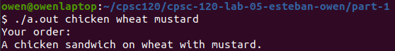

# Hello World

This is my home page! My name is Owen Rotenberg and I am a student at [Cal State Fullerton](http://www.fullerton.edu/) and my major is Computer Science.

## Computer Science Projects

My GitHub page is http://github.com/rotenbergowen.

### CPSC 120

* Lab 5

    Part 1 of our 5th lab of the semester was very impactful in my journey to
    become a programmer. I was tasked with making a Mad Lib that would prompt
    the user for words and then put them all together and output a sentence.
    This was the first time I made an interactive program where my inputs
    would have a direct effect on what was outputted by the program.
    This was a big step forward and it layed the groundwork for the rest
    of my labs.                                                  
                   
    Above is a screenshot of my gradient that I personally made in this lab.
* Lab 8

    In the first part of lab 8, my task was to search a text file,
    identify palendromes, and to print them out for the user to see. I really
    find this skill valuable because it bridged the gap between making a
    program that only takes input from the command line or prompting the user
    and reading data from an outside file. For any job in the future where
    I may need to interpret a large amount of data, there is no better way
    to do it than with a computer program. I will improve on this basic skill
    and I will no-doubt use it in the future.

* Lab 10

    The third and final part of this difficult lab required the use of the
    Graphics Magick plugin to create a square png image with different
    colors fading togethere creating a rainbow gradient. Nested loops were used
    to individually go through each row and column of pixels, decide a color
    using math to make it fade evenly, and add it to the image. I really
    enjoyed this lab because of the final image I created. It was a beautiful
    picture that I made, rather than some boring text like in the previous
    lab. I finally was able to take my coding skills and create a piece of art
    and my new understanding of doing this will definitely help in the future.
                       
    Above is the output of my madlib after entering the parameters as command
    line arguments.